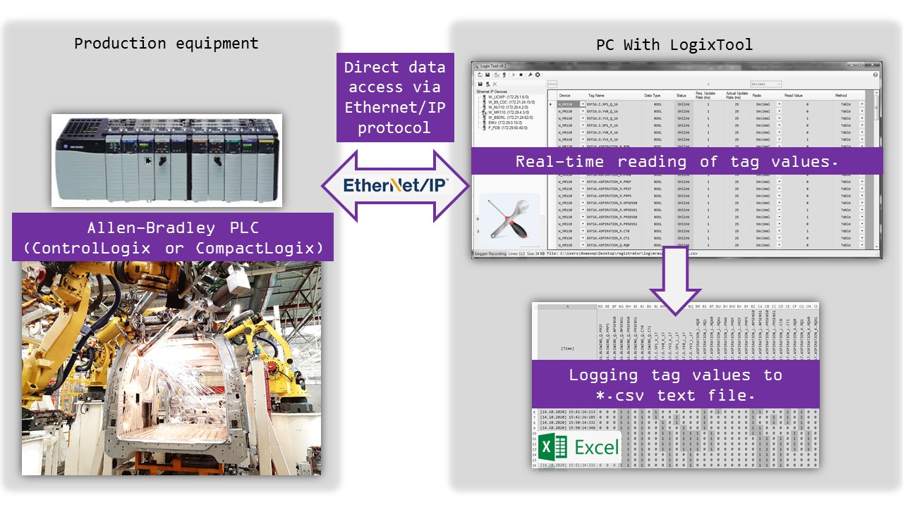

# LogixTool

## Description

Small and very useful tool for tags values monitoring and logging to text file via EthernetIP connection
directly to PLC without any OPC servers.

LogixTool can help you logging of PLC tag values to file in Real Time.

LogixTool capable save your valuable time, money and keep your issues under control.

## Application

Production automation based on Allen-Bradley PLC (ControlLogix, CompactLogix).

>Was successfuly tested with 18.11, 16.00 versions.

## Requirements

- Windows XP and newer.
- .Net Framework 4.0 is required.
 

## Installation and Running

1. For using application .Net Framework 4.0 is required. Please [download](https://www.microsoft.com/ru-ru/download/details.aspx?id=17718)
 from official source.

2. Please copy content from LogixTool/LogixTool/Release/ folder.

3. Run LogixTool.exe file.

